# Linux Web Server Deployment, Monitoring & Security

## 📌 Project Overview

This project demonstrates how to **deploy, monitor, and secure a production-style Linux web server environment** using **AlmaLinux**.

The setup includes:

- LAMP Stack Deployment
- Infrastructure Monitoring using Prometheus and Grafana
- Apache Virtual Hosting
- Linux Server Security Hardening

This project showcases **practical Linux System Administration and Monitoring skills**.

---

# 🏗 Architecture

| Component | Tool |
|-----------|------|
| Operating System | AlmaLinux |
| Web Server | Apache |
| Database | MariaDB |
| Backend Language | PHP |
| Monitoring | Prometheus |
| Visualization | Grafana |
| Metrics Exporter | Node Exporter |
| Security | Firewalld, Fail2Ban, SSH Hardening, SELinux |

---

# 📦 Project Components

---

# 1️⃣ LAMP Stack Deployment

Installed **Apache, MariaDB, and PHP** to host web applications.

## Install Packages
```bash
dnf install httpd -y
dnf install mariadb-server -y
dnf install php -y
dnf install php-mysqlnd -y
```


```bash
Start Services
systemctl enable --now httpd
systemctl enable --now mariadb
Verify Installation
php -v
mysql --version
systemctl status httpd
Test Web Server
echo "Linux Web Server Working" > /var/www/html/index.html
```
Open in browser:

`http://SERVER-IP`

### Screenshot
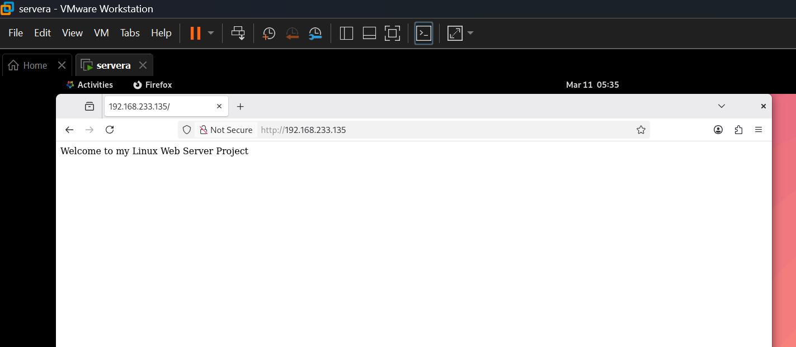

# 2️⃣ Server Monitoring (Prometheus + Grafana)

Installed **Prometheus**, **Node Exporter**, and **Grafana** to monitor the Linux server and visualize system metrics.

---

## Monitoring Tools

- Prometheus
- Node Exporter
- Grafana

---

## Install Node Exporter

Download Node Exporter from GitHub.

```bash
cd /opt
wget https://github.com/prometheus/node_exporter/releases/latest/download/node_exporter-1.7.0.linux-amd64.tar.gz
```

Extract the archive:

```bash
tar -xzf node_exporter-1.7.0.linux-amd64.tar.gz
```

Start Node Exporter:

```bash
cd node_exporter-1.7.0.linux-amd64
./node_exporter &
```

---

## Install Prometheus

Download Prometheus:

```bash
cd /opt
wget https://github.com/prometheus/prometheus/releases/latest/download/prometheus-2.52.0.linux-amd64.tar.gz
```

Extract the archive:

```bash
tar -xzf prometheus-2.52.0.linux-amd64.tar.gz
```

Start Prometheus:

```bash
cd prometheus-2.52.0.linux-amd64
./prometheus &
```

---

## Install Grafana

Install Grafana:

```bash
dnf install -y https://dl.grafana.com/enterprise/release/grafana-enterprise-10.4.2-1.x86_64.rpm
```

Start and enable Grafana:

```bash
systemctl enable --now grafana-server
```

---

## Metrics Monitored

- CPU Usage
- Memory Usage
- Disk Usage
- Network Traffic
- System Load
- System Uptime

---

## Node Exporter Metrics

Node Exporter exposes Linux system metrics for Prometheus.

Access Node Exporter metrics:

`http://SERVER-IP:9100/metrics`

### Screenshot

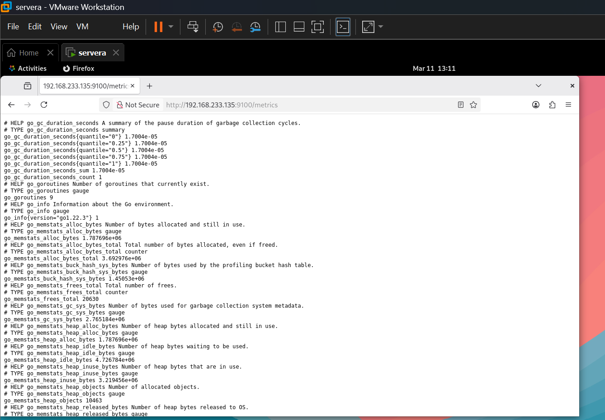

---

## Prometheus Targets

Prometheus scrapes metrics from configured targets.

Access Prometheus interface:

`http://SERVER-IP:9090`

Verify that **node_exporter** is listed and showing **UP**.

### Screenshot

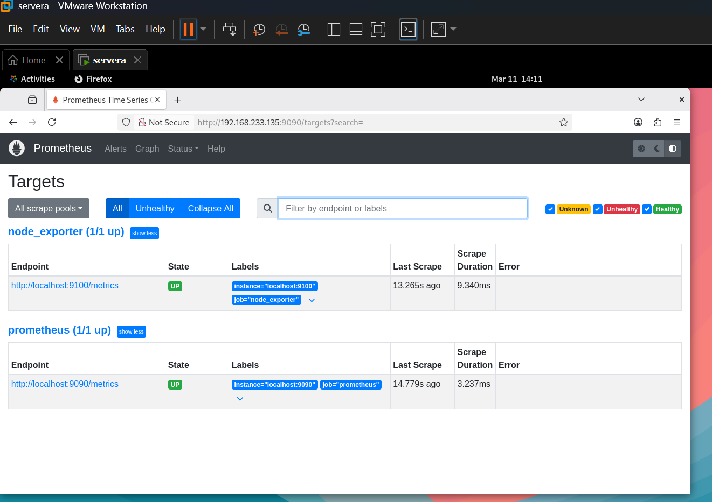

---

## Grafana Dashboard

Grafana was configured to use **Prometheus as the data source**.

Dashboard used:

`Node Exporter Full Dashboard (ID: 1860)`

Access Grafana:

`http://SERVER-IP:3000`

### Screenshot

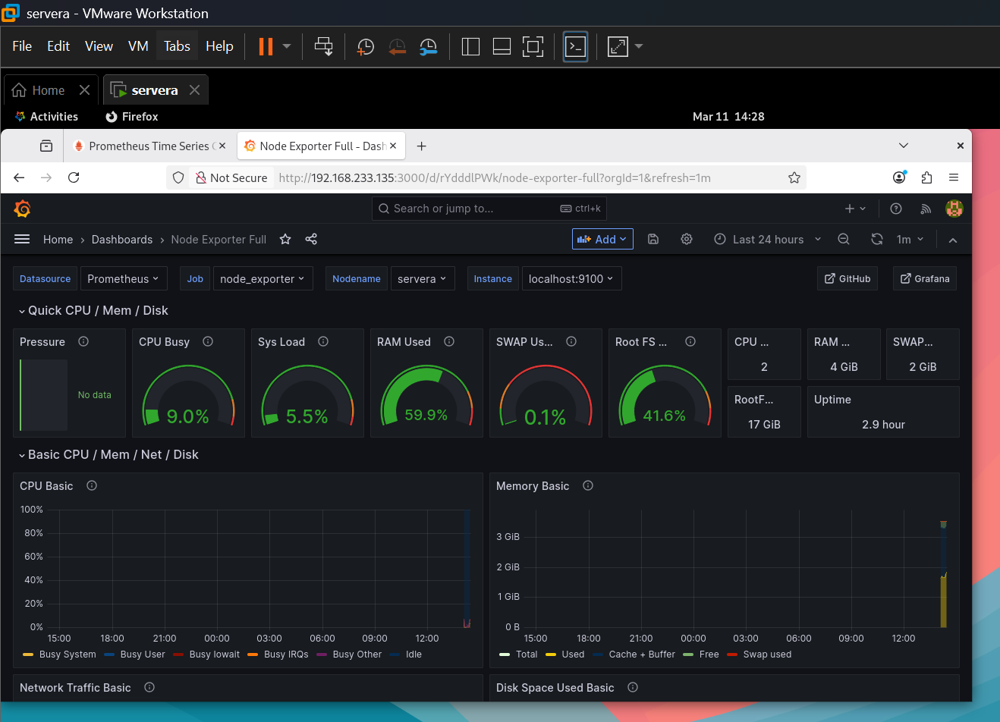

# 3️⃣ Apache Virtual Hosting

Configured Apache to host multiple websites on a single server using different domain names.

## Example Domains

```
site1.local
site2.local
```

## Directory Structure

```
/var/www/site1
/var/www/site2
```

## Example VirtualHost Configuration

```apache
<VirtualHost *:80>
    ServerName site1.local
    DocumentRoot /var/www/site1
</VirtualHost>

<VirtualHost *:80>
    ServerName site2.local
    DocumentRoot /var/www/site2
</VirtualHost>
```

## Testing

```
curl http://site1.local
curl http://site2.local
```

### Screenshot

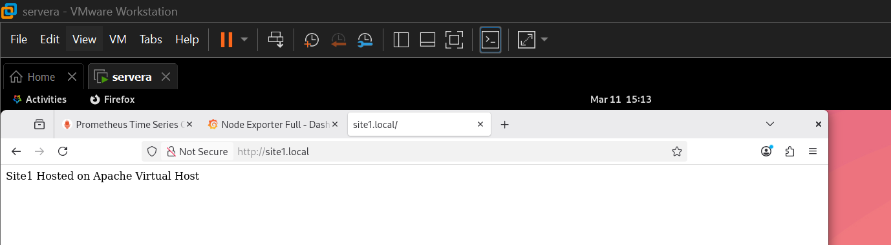
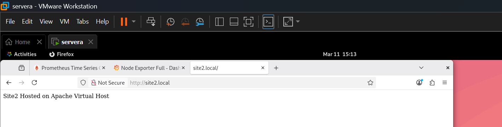
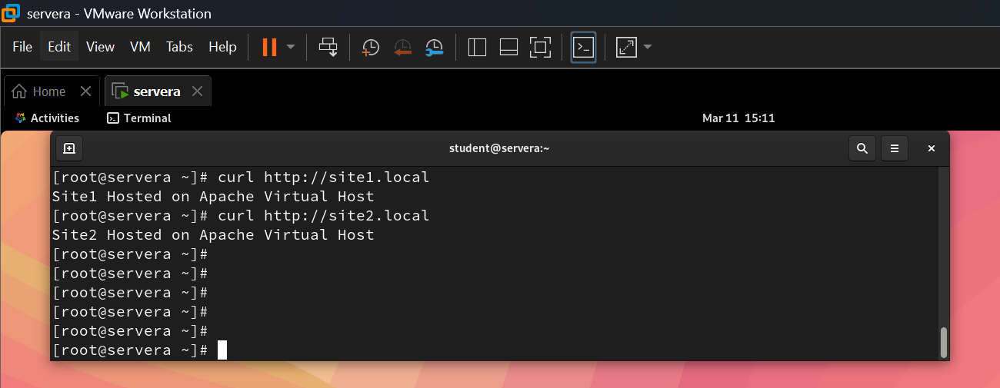

# 4️⃣ Linux Server Security Hardening

Implemented multiple security measures to improve the security of the Linux web server.

---

## 🔐 SSH Hardening

Edited the SSH configuration file to disable insecure login methods.

Edit configuration file:

```bash
vim /etc/ssh/sshd_config
```
Security settings applied:
```bash
PermitRootLogin no
PasswordAuthentication no
PermitEmptyPasswords no
```
Restart SSH service:
```bash
systemctl restart sshd
```
Verify SSH service:
```bash
systemctl status sshd
```
### Screenshot
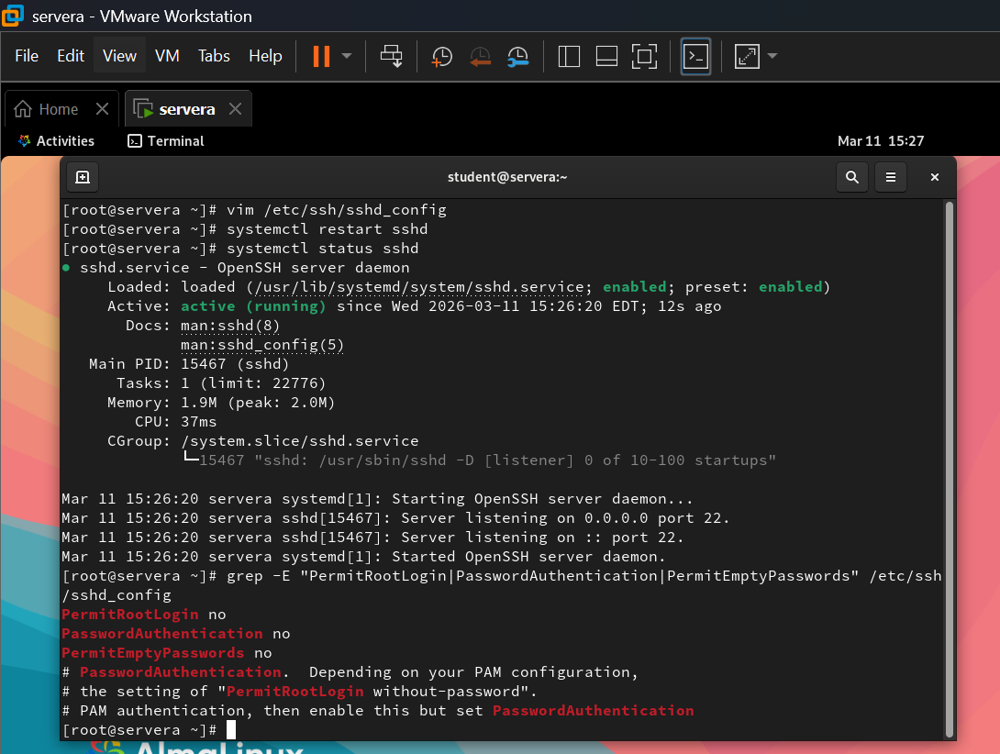

## 🔥 Firewall Configuration

Configured Firewalld to allow required services.
```bash
firewall-cmd --permanent --add-service=http
firewall-cmd --permanent --add-service=https
firewall-cmd --permanent --add-service=ssh
firewall-cmd --reload
```
Verify firewall rules:
```bash
firewall-cmd --list-all
```
Screenshot
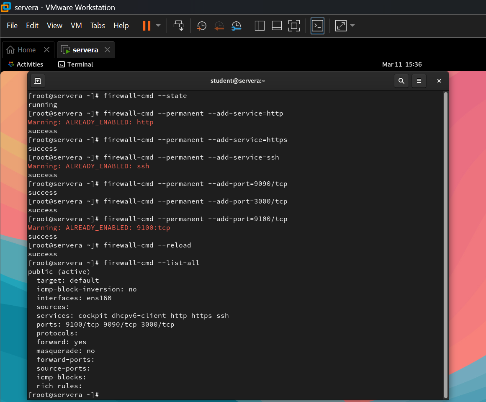

## 🛡 Fail2Ban Intrusion Protection

Installed **Fail2Ban** to protect the server from brute-force login attacks.

Enable the EPEL repository (required for Fail2Ban):
```bash
dnf install epel-release -y
```

Install Fail2Ban:
```bash
dnf install fail2ban -y
```
Start and enable service:
```bash
systemctl enable --now fail2ban
```
Check Fail2Ban status:
```bash
fail2ban-client status
```
Screenshot
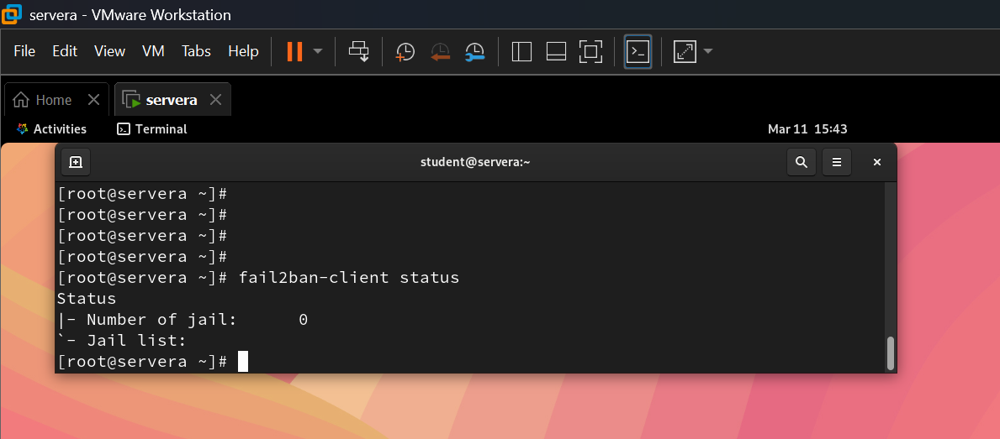

## 🧩 SELinux Verification
Checked SELinux status to ensure security policies are enforced.
```bash
getenforce
sestatus
```
Expected output:
```bash
Enforcing
```
Screenshot
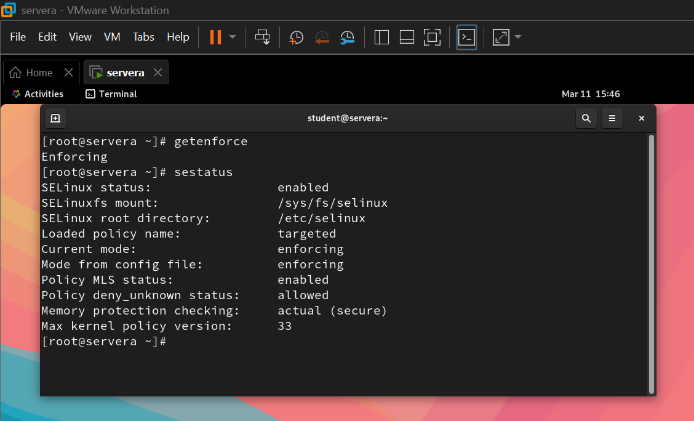

## 🧠 Skills Demonstrated

- Linux System Administration
- Web Server Deployment
- Infrastructure Monitoring
- Linux Security Hardening
- Networking & Firewall Configuration
- Troubleshooting & Diagnostics

---

## ⚙ Technologies Used

- Linux (AlmaLinux)
- Apache HTTP Server
- MariaDB
- PHP
- Prometheus
- Grafana
- Node Exporter
- Firewalld
- Fail2Ban
- SELinux

---

## 🎯 Conclusion

This project demonstrates how to deploy, monitor, and secure a Linux-based web server environment using industry-standard tools.
It highlights core skills required for Linux System Administration and DevOps roles, including web server deployment, monitoring, security hardening, and infrastructure management.
